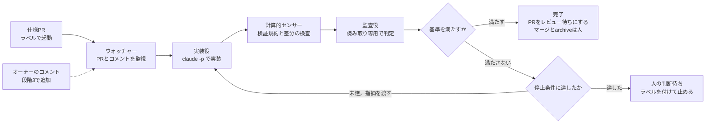

# ループエンジニアリング導入提案（2026-09-30）

ループエンジニアリングを試験的にハーネスへ取り入れるための、調査と提案の記録。
決定はgrillingで行い、`openspec/changes/` に残す。この文書は書いたときのまま残す。

## 要約

試験の最初の段階では、サーバーを使わずに「仕様PR、実装と監査のループ、完了か人の判断待ち」を手元で動かす。サーバーでの常駐とコメント駆動は、その結果を見てから足す。

- 作るもの：`/spec` の出口で仕様PRを作る手順と、ループ本体。仕様PRは、OpenSpecの変更（grilling.mdからtasks.mdまで）を含み、ループの作業指示になるPRとMRを指す。ループ本体は、1つの仕様PRについて実装役と監査役を停止条件まで交互に起動する
- 役割：実装役はコードを書くエージェント、監査役は実装役と別の文脈で完了を判定するエージェントである。続けるか止めるかはスクリプトが決める
- 実行の場所：段階2では、サーバー単位で1つのウォッチャーを置く。リポジトリ単位のCIにはしない。GitHubとGitLabを同じ実装で扱い、ハーネスのhookをそのまま使い、プロダクトリポジトリにファイルを足さないためである
- 完了の判定：計算的センサー、仕様の網羅、監査役の判定の3層がすべて通ったときだけ完了とする。回数、費用、進展なし、人の判断の4つの停止条件を必ず置く
- 人が持つもの：起動（ラベルを付ける）、マージ、archive
- 既製品との関係：GitHubに限れば、auto-fixとroutinesで構想の一部が動く。自作するのは、GitLab対応、OpenSpecを基準にした監査、サーバー側でのハーネスのhookの3点に絞る

## 調査：AIコーディングにおけるループ

「ループエンジニアリング」は2026年6月に広まった呼び名で、エージェントへの指示を毎回書く代わりに、指示を出す仕組みを設計することを指す。構成要素の語彙はそろってきたが、効果の実証はまだ少ない。

[Addy Osmani](https://addyosmani.com/blog/loop-engineering/)は2026-06-07の記事で、この実践を「エージェントに指示を出す人の役を、自分から仕組みへ置き換えること」と定義した。起点としてBoris ChernyとPeter Steinbergerの発言を挙げている。構成要素は、定期実行、worktree、スキル、コネクター、実装と検証を分けるsubagent、セッションをまたぐ状態の記録である。同じ記事は、トークンの費用と、人が出力を読まなくなることによる理解の負債を注意点に挙げる。

[arXivの論文](https://arxiv.org/abs/2608.21884)（2026-08-22）は、ループを「定期実行かリポジトリの出来事を契機に実行を始め、機械が確かめられる条件を満たしたら止める仕組み」と定義した。36,710のリポジトリを調べ、確認できた自律ループは217件だった。要素は、起動条件、機械で判定する停止条件、状態ファイル、検証役のsubagent、トークン予算、人への引き継ぎである。ただし状態ファイルをコミットしている例はほとんど無かった。

### ループの層

同じ「ループ」でも、繰り返す単位と止める主体が層ごとに違う。この提案が新しく作るのはL3とL4である。

| 層 | 中身 | 例 | ハーネスの今 |
| --- | --- | --- | --- |
| L1 ツール呼び出し | 1回の実行の中で、文脈を集め、操作し、確かめることを繰り返す | Claude Codeの1ターン | ある |
| L2 1セッション内の生成と評価 | ターンの終わりに条件を判定し、満たすまで続ける | `/goal`、Stop hook、ralph-wiggumプラグイン | verify gate |
| L3 新しい文脈での反復 | 毎回新しいプロセスを起動し、計画と仕様を読んで進める | Ralph、Anthropicのinitializerとcoding agent | 無い（段階1で作る） |
| L4 イベント駆動の外側のループ | PR、Issue、CIの出来事を受けて実行を起動する | Copilot cloud agent、claude-code-action、auto-fix、Symphony | 無い（段階2と3で作る） |
| L5 人の関門 | レビューとマージ | どの製品も人がマージする | `/archive-push` |

L3の代表は[Geoffrey HuntleyのRalph](https://ghuntley.com/ralph/)である。`while :; do cat PROMPT.md | claude-code ; done` のように毎回新しいプロセスを起動し、計画ファイルと仕様を読んで1項目ずつ進める。テストと型検査が不完全な実装を拒否する。Huntley自身は、既存のコードには使わないと書いている。

### 実装と監査を分ける根拠

実装役に自己評価させると判定が甘くなる。分離した監査役も、会話だけを読むのでは不十分で、外部の状態を確かめる手段が要る。

- [Anthropic](https://www.anthropic.com/engineering/building-effective-agents)（2024-12-19）は、生成役と評価役を分ける型（evaluator-optimizer）を「評価基準が明確で、反復で測れる改善が得られるとき」に使うとした。自律エージェントには最大反復回数などの停止条件を置くことも勧めている
- [Anthropic](https://www.anthropic.com/engineering/harness-design-long-running-apps)（2026-03-24）の実験では、エージェントは凡庸な成果も自信をもって褒めた。生成役を自己批判的にするより、独立した評価役を懐疑的に調整するほうがずっと扱いやすかった
- 同じ実験の評価役は、問題を見つけても通してしまうことや、表面的なテストで済ませることがあった。対策として、実装の前に「完了とは何か」を両者で合意している。費用は単独の生成が9ドル、評価役を含むハーネスが200ドルだった。モデルが単独でこなせる難度では、評価役は余分な費用になる
- [arXivの論文](https://arxiv.org/abs/2607.25152)（2026-07-27）では、54サイクルのすべてでエージェントが改善を主張したが、56%は測定上の変化がゼロ以下だった。会話の中だけを読む判定役は、実際の退行の44%を通した。成否を成果物から直接検証できる課題では、この錯覚は消えた

この結果が、完了基準の土台を計算的センサーに置き、監査役に検証コマンドを実行させる設計の根拠である。specsのシナリオは、上の実験が実装の前に合意した「完了の定義」にあたる。

### 製品の形

各社のPRとIssueのループは同じ形をしている。書き込み権限を持つ人が起動し、隔離した環境で実行し、ブランチかPRを出し、人がマージする。

| 製品 | 起動 | 実行場所 | 特徴 |
| --- | --- | --- | --- |
| [GitHub Copilot cloud agent](https://docs.github.com/en/copilot/concepts/agents/coding-agent/about-coding-agent) | Issueの割り当て、PRでの `@copilot` | GitHub Actions上の使い捨ての環境 | 1セッションは最大59分 |
| [Claude Code GitHub Actions](https://code.claude.com/docs/en/github-actions) | `@claude` のメンション、または `prompt` の入力 | 自分のActionsランナー | 1つのコメントを作業しながら更新する。書き込み権限の無い人とbotは既定で起動できない |
| [Claude Code GitLab CI/CD](https://code.claude.com/docs/en/gitlab-ci-cd) | コメントでのメンション。受け口のwebhookは自分で用意する | GitLabのランナー | ベータで、GitLabが保守する |
| [auto-fix](https://code.claude.com/docs/en/claude-code-on-the-web) | PR単位で有効にする | Anthropicのクラウド | CIの失敗とレビューコメントを受けて修正をpushする。曖昧な指摘は人に尋ねる。GitHubのみ |
| [routines](https://code.claude.com/docs/en/routines) | 定期実行、API、GitHubのPRとReleaseのイベント | Anthropicのクラウドか自前の環境 | 研究プレビュー。出来事ごとに別のセッションを起動し、`claude/` で始まるブランチへpushする |
| [Symphony](https://github.com/openai/symphony/blob/main/SPEC.md)（OpenAI） | Issueトラッカーを30秒ごとにポーリング | 自前の常駐サービス | 仕様の草案。起動の前に処理中かどうかを確かめて二重起動を防ぐ。「Human Review」などの状態で人へ渡す |

サーバー単位のウォッチャーに近いのはSymphonyである。ポーリング、処理中の記録による二重起動の防止、作業単位ごとの作業場所という構成は、設計判断の節の推奨と同じである。

## 構想への指摘

当初の構想は次の3点だった。仕様をgrillingとSDDで先にまとめてPR/MRを作る機能を作る。サーバー側でPR/MR/Issueを監視し、実装役と監査役を分けて基準を満たすまでループするモジュールを作る。PR/MR/Issueへのユーザーのコメントを受けてさらに修正する。

方向は妥当である。次の5点を補正すると、試験の範囲と成否の判定がはっきりする。

1. ループは1種類ではない。AIコーディングで言うループには少なくとも4つの層がある（調査の節）。構想の中心は、出来事を受けて起動する外側のループと、実装と監査のループの2つである。成否を決めるのは繰り返しの仕組みではなく、完了を判定する基準である。
2. 「基準を満たすまで」の判定をLLMの監査役だけに任せると、判定が甘くなるか、毎回違う指摘が出て終わらない。基準の土台は計算的なセンサー（検証規約、テスト、`openspec validate`）に置き、監査役はspecsのシナリオとの照合のような計算できない部分だけを判定する。なお `/goal` の評価モデルは会話の記録だけを読み、コマンドの実行とファイルの読み取りはしない。そのため独立した監査役の代わりにはならない。
3. 反復の上限は必須である。回数、費用、進展の有無の3条件で止め、止めたらPRに「人の判断待ち」を示して終える。上限の無いループでは費用が増え続け、テストを消して検証を通すような近道が起きる。
4. GitHubでは、構想の一部が既製の機能で動く。Claude GitHub Appを入れたリポジトリでは、auto-fixがCIの失敗とレビューコメントを受けて修正をpushする。routinesはPRのイベント（opened、labeledなど）でクラウドのセッションを起動する。自作が必要なのは、GitLab対応、OpenSpecの成果物を基準にした監査、ハーネスのhookをサーバー側でも動かすことの3点である。
5. Issueは仕様がまだ無い段階の入口である。grillingは対話が前提なので、Issueから直接実装のループへ入ると基準の無いループになる。Issueは仕様を作る側の入口として扱い、実装のループは仕様PRだけを対象にする。

## 現状のハーネスとの対応

ハーネスには、1セッションの中で検証を繰り返す仕組みが既にある。足りないのは、PRやIssueの出来事を受けてセッションを起動する外側の仕組みと、実装役から独立した監査役である。

| 要素 | 今の形 | ループの中での位置 | 足りないこと |
| --- | --- | --- | --- |
| `/spec` | 対話でgrilling.mdを作り、proposal・specs・design・tasksを生成する | 完了基準の出典。specsのシナリオとtasksの行が監査の採点項目になる | 生成で止まり、ブランチとPRを作る出口が無い |
| `/opsx:apply` とTDDスキル | tasksを失敗テスト先行で消化する | 実装役の手順 | 人がセッションを開いて起動する前提 |
| verify gate | 作業ツリーが変わったセッションで検証規約を走らせ、失敗中は1ターンに3回まで終了を止める | 最も内側の、計算的な検証ループ | 3回で止めたあとの扱いを人が決める |
| `/goal` | ADR-0001 §8で長時間の自律作業を任せたネイティブ機能 | 1セッションの中で条件を満たすまで続ける | PRやIssueとは結び付かない |
| `/code-review` | Claude Codeの組み込み。差分のバグを探す | 推論的センサーの候補 | 仕様（specs）との照合はしない |
| `pr` スキル | GitHubのPRとGitLabのMRを作る | ループの出口 | なし |
| `/archive-push` | 変更を閉じてpushする。起動するのはユーザーだけ | ループの外。人が完了を宣言する | なし（ループに入れない） |
| managed clone | 作業ツリーを持たないマシンに参照点として置くクローン | サーバーへハーネスを入れる手段 | なし |

今のハーネスに全く無いものは次の5つである。

- 外側のループ：PR・Issue・コメントの出来事を受けてセッションを起動する仕組み
- 監査役：実装役と別の文脈で判定し、結果を決まった形式で返すエージェント
- 進捗の共有：PRやIssueへ状況をコメントで書く仕組み
- 停止条件：反復回数、費用、進展の有無によるループ全体の打ち切り
- 実行環境：サーバーでの認証と、ジョブごとの隔離

## 設計判断

実行はサーバー単位で1つのプロセスにし、対象はリポジトリごとにopt-inで選ぶ。実装役と監査役はラウンドごとに別の `claude -p` として起動し、続けるか止めるかはLLMではなくスクリプトが決める。

監査を通れば完了とする。通らなければ停止条件を確かめ、上限の内なら指摘を実装役へ渡して次のラウンドに進む。

| 論点 | 推奨 | 理由 | 退けた案 |
| --- | --- | --- | --- |
| 実行の場所 | 常時動くマシン1台に置くウォッチャー1つ | GitHubとGitLabを同じ実装で扱える。ハーネスのhookとスキルをmanaged cloneでそのまま使える。プロダクトリポジトリにファイルを足さない | リポジトリごとのCI（workflowと秘密情報がリポジトリの数だけ増え、ハーネスのhookが無い）。routines（GitHubだけ。PRとReleaseのイベントでだけ起動し、コメントでは起動しない） |
| 対象の選び方 | サーバー側の設定にリポジトリを並べ、PRにラベル `<loop>` が付いたら起動する | 起動を人の明示的な操作に限る | すべてのPRで起動（費用が読めない） |
| 出来事の検知 | 1〜2分ごとのポーリング（`gh api`、`glab api`） | 公開の受け口が要らない。処理済みのコメントIDとheadのSHAを記録し、同じ出来事を二度処理しない | webhook（家庭内のマシンでは公開の受け口を別に用意する） |
| 実装役と監査役 | ラウンドごとに別の `claude -p` を起動する。監査役には読み取りと検証コマンドだけを許可し、`--json-schema` で判定を返させる | 毎回新しい文脈で判定できる。続行の判断をスクリプトが持つので、停止条件を確実に守れる | 1セッション内のsubagent（文脈が積み上がり、続行の判断がLLMに残る）。`/goal`（評価モデルが会話の記録しか見ない） |
| 進捗の共有 | PRごとに1つの進捗コメントを書き換える。新しいコメントは完了と人の判断待ちのときだけ書く | 通知の数を抑え、今の状態を1か所で見られる | ラウンドごとに新しいコメントを書く |
| コメントへの応答 | 許可したユーザー（オーナー）のコメントとレビューだけを起動条件にする。仕様が変わる指摘は、先にOpenSpecの成果物を直してから実装する | 第三者の書き込みを指示として扱わない。仕様を正本に保つ | 誰のコメントでも起動する |
| 同時実行 | 1PRにつきジョブは1つ。実行中に届いた出来事は次のラウンドへまとめる | 同じブランチへの競合したpushを防ぐ | 出来事ごとに並列で実行する |

完了基準は3層に分け、すべてを満たしたときだけ完了とする。

- 計算的センサー：検証規約が成功し、`openspec validate <change> --strict` が通る。既存のテストを消していないこと、skipにしていないこと、検証の設定を書き換えていないことを差分で確かめる
- 仕様の網羅：tasks.mdの行がすべて `- [x]` になっている。変更のspecsの各シナリオについて、それを確かめるテストを監査役が1つ以上挙げている
- 監査役の判定：修正必須の指摘が0件である

停止条件は次の4つである。数字は試験の初期値で、grillingで決める。

- ラウンド数：5回（1ラウンドは実装、検証、監査の1巡）
- 費用：`claude -p` の1回ごとに `--max-budget-usd` を渡し、PRごとと1日ごとの合計にも上限を置く
- 進展なし：連続する2ラウンドで、修正必須の指摘と失敗するテストの集合が変わらない
- 人の判断が要る：実装役か監査役が、仕様の曖昧さなどで決められないと返した

止めたときはラベル `<loop:needs-human>` を付け、理由を進捗コメントに書く。マージとarchiveはどの段階でも人が行う。

## 提案する範囲

3段階に分け、各段階の終わりに次へ進む条件を置く。段階1はサーバーを使わず、手元から手動で起動してループ本体の出来を確かめる。サーバーとコメント駆動は、本体が使えると分かってから足す。

| 段階 | 内容 | 次の段階へ進む条件 |
| --- | --- | --- |
| 1 仕様PRとループ本体 | 手元から手動で起動する。GitHubだけを対象にし、サーバーは使わない | 3件の変更で完走する。費用とラウンド数が分かる。監査の誤りが少ない |
| 2 サーバーで常駐 | ポーリングで自動起動する。GitLabにも対応し、managed cloneで導入する | 1週間、無人で動かす。二重起動と取りこぼしが0件。費用が上限の内に収まる |
| 3 コメント駆動 | オーナーのコメントで追加のラウンドを起動する。Issueから仕様PRの下書きを作る | なし |

各段階で作るものは次の表のとおり。数字は試験の初期値で、grillingで決める。

| 段階 | 作るもの | 置き場所の案 |
| --- | --- | --- |
| 1 | `/spec` の最後に仕様PRを作る手順（ブランチ、コミット、draft PR。本文はproposalの要約とtasks） | `skills/spec/SKILL.md` に1段階を足すか、新しいスキル `<spec-pr>` を作る |
| 1 | ループ本体 `<uskn-loop run>`。1つのPRについてworktreeを作り、停止条件まで実装と監査を繰り返し、進捗コメントを書き換える | `plugins/uskn-harness/bin/` とbatsテスト（`claude` と `gh` は偽物に差し替える） |
| 1 | 監査役の指示と、判定のJSON Schema | プラグインの中。置き場はgrillingで決める |
| 1 | 差分の検査（テストの削除とskip化、検証の設定の変更を検出する） | ループ本体と同じ場所。bashとjqで書く |
| 2 | ウォッチャー `<uskn-loop watch>`。ポーリング、キュー、1PRに1ジョブのロック、処理済みの記録 | ループ本体と同じ場所 |
| 2 | サーバーへの導入手順。managed clone、`uskn-harness sync`、systemdのサービス（ユーザー単位）、トークン | `docs/` の手順書と `uskn-harness doctor` の確認項目 |
| 2 | GitLab対応（`glab`） | ループ本体とウォッチャーの中 |
| 3 | オーナーのコメントとレビューで追加のラウンドを起動する | ウォッチャーの中 |
| 3 | Issueから仕様PRの下書きを作る試験。grillingをIssueのコメント上で進める。実装のループには入れない | 新しいスキル |

作らないものは次のとおり。

- 自動マージと、既定ブランチへの直接のpush
- archiveの自動実行。人が承認したあとに限り、方式はgrillingで決める
- webhookの受け口。ポーリングの遅延が問題になった時点で検討する
- 多数のPRの並列実行。同時に動くジョブは1〜2件にする
- ダッシュボードなどの専用のUI。PRのコメントとラベルで状態を示す
- 第三者のコメントへの応答

## リスクと安全策

最大のリスクは、第三者の書き込みを指示として実行することである。起動条件をオーナーの操作に限り、ジョブごとに隔離した環境で動かす。

| リスク | 起きること | 対策 |
| --- | --- | --- |
| コメント経由の指示注入 | 第三者がIssueやPR、コードに指示を隠す。claude-code-actionの文書は、HTMLコメントや不可視文字を除去しても新しい回避策が出うると書いている | 起動条件と渡すコメントをオーナーのものに限る。公開リポジトリ（このハーネスを含む）は段階2まで対象にしない |
| 秘密情報の流出 | エージェントがトークンや `.env` を読み、コメントやコミットへ書く | ジョブごとにコンテナを分ける。GitHubのトークンは対象リポジトリだけ、権限はcontentsとpull requestsだけにする。外向きの通信を許可リストで絞る |
| 費用の増大 | 終わらないループや、指摘と修正の往復が続く | 停止条件の4つ、1日の合計の上限、同時実行1〜2件 |
| 見かけの合格 | 実装役がテストを消す、skipにする、期待値を書き換える、検証の設定を変える | 差分の検査で機械的に検出し、監査役の確認項目にも入れる |
| 監査の判定の揺れ | 同じコードに毎回違う指摘が出る。または何でも通す | 判定の形をJSON Schemaで固定し、修正必須の指摘をspecsのシナリオに結び付ける。段階1では人が指摘を採点し、誤りの割合を記録する |
| 自分自身による再起動 | ループが書いたコメントやpushが、再び起動条件を満たす | 自分の書き込みを印で見分けて除外する。auto-fixの文書も、エージェントのコメントが他の自動化を起動しうると警告している |
| 常駐マシンの資格情報 | Claudeの長期トークンとGitHub・GitLabのトークンが1台に集まる | 有効期限のあるfine-grained tokenを使い、失効の手順を導入手順書に書く |

指示注入には実際の事故がある。2025-05には、公開リポジトリのIssueに仕込んだ指示により、GitHub MCPを使うエージェントが非公開リポジトリの内容を公開のPRへ書き出した（[Invariant Labs](https://invariantlabs.ai/blog/mcp-github-vulnerability)）。2026-01には、claude-code-actionが名前の末尾が `[bot]` の起動者を検査せずに通す欠陥が報告され、v1.0.94で修正された（[The Hacker News](https://thehackernews.com/2026/06/claude-code-github-action-flaw-let-one.html)）。

ハーネスのhookはサーバー上でもそのまま動く。write-guardはプロジェクトルートの外への書き込みを拒否し、bash-guardは他のリポジトリへのpushを拒否する。この2つが、コンテナの内側にもう一段の制限を加える。

## 次の一手

段階1を `/spec` にかける。実行の場所とハーネスの境界は、ADRとして別に残す。

| changeの候補 | 中身 | 規模 |
| --- | --- | --- |
| `<add-spec-pr>` | `/spec` の出口で仕様PRを作る | 小さい |
| `<add-loop-run>` | ループ本体、監査役、差分の検査、進捗コメント | 大きい |

grillingで決める論点は次のとおり。

- 常時動かすマシンはどれか（自宅のサーバー、VPS、手元のPC）。段階2の前提になる
- 認証の方式。サブスクリプション（`claude setup-token`）とAPIキーのどちらにするか。サブスクリプション認証のとき `--max-budget-usd` がどう数えられるかは未確認
- 停止条件の数値（ラウンド数、`claude -p` 1回・1PR・1日ごとの費用の上限）
- 監査役のモデルとeffort。実装役と同じモデルにするか
- 監査役の指示と判定のJSON Schemaの置き場
- archiveの時点。承認後にループがブランチ上でarchiveするか、マージ後に人が `/archive-push` を走らせるか。今の `/archive-push` は既定ブランチへ直接pushする
- ループ本体の実装言語。hookと同じbashとjqか、Agent SDK（TypeScript）か
- ラベルの名前、進捗コメントの形式、仕様PRのブランチ名

grillingの前に、作らずに試せることが1つある。GitHubの1リポジトリで、1つのPRのauto-fixを有効にする。コメントを受けて修正する動きが、自分の使い方に合うかを見る。合うなら、段階3のGitHub側は自作せずにauto-fixで済ませられる。

## 出典

すべて2026-09-30に閲覧した。ハーネス内の根拠は `docs/adr/0001-harness-architecture.md` と `docs/proposal-2026-09.md` である。

- [Loop Engineering（Addy Osmani、2026-06-07）](https://addyosmani.com/blog/loop-engineering/)
- [Loop Engineering: Building Blocks, Adoption, and Impact（arXiv、2026-08-22）](https://arxiv.org/abs/2608.21884)
- [Self-Evaluation Bias in LLM Agent Loops（arXiv、2026-07-27）](https://arxiv.org/abs/2607.25152)
- [Building effective agents（Anthropic、2024-12-19）](https://www.anthropic.com/engineering/building-effective-agents)
- [Harness design for long-running apps（Anthropic、2026-03-24）](https://www.anthropic.com/engineering/harness-design-long-running-apps)
- [Ralph（Geoffrey Huntley）](https://ghuntley.com/ralph/)
- [/goal（Claude Code Docs）](https://code.claude.com/docs/en/goal)
- [Routines（Claude Code Docs）](https://code.claude.com/docs/en/routines)
- [Claude Code in the cloudとauto-fix（Claude Code Docs）](https://code.claude.com/docs/en/claude-code-on-the-web)
- [GitHub Actions（Claude Code Docs）](https://code.claude.com/docs/en/github-actions)
- [GitLab CI/CD（Claude Code Docs）](https://code.claude.com/docs/en/gitlab-ci-cd)
- [CLI reference（Claude Code Docs）](https://code.claude.com/docs/en/cli-reference)
- [claude-code-action security](https://github.com/anthropics/claude-code-action/blob/main/docs/security.md)
- [About Copilot cloud agent（GitHub Docs）](https://docs.github.com/en/copilot/concepts/agents/coding-agent/about-coding-agent)
- [Symphony SPEC（OpenAI）](https://github.com/openai/symphony/blob/main/SPEC.md)
- [GitHub MCP Exploited（Invariant Labs、2025-05-26）](https://invariantlabs.ai/blog/mcp-github-vulnerability)
- [Claude Code GitHub Action flaw（The Hacker News、2026-06-04）](https://thehackernews.com/2026/06/claude-code-github-action-flaw-let-one.html)
